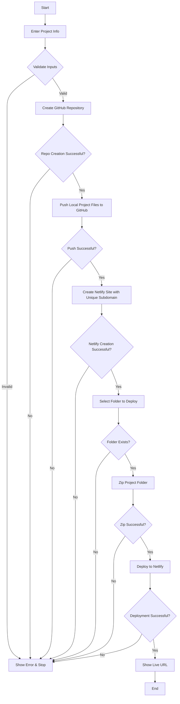

# **DevOps Auto-Deploy System**
### Automated CI/CD Pipeline for Static Web Applications

---

## **Project Information**

**Team Members:**
* Abouelfetouh Ashraf
* Mustafa AbdulRazek AbdulRazek
* Abd Alsttar Kamel Hamed

**Program:** Digital Egypt Pioneers Initiative (DEPI) – DevOps Engineer Track  
**Submission Date:** November 2025  
**Project Type:** Graduation Project

---

## **Project Abstract**

The DevOps Auto-Deploy System is a command-line tool that automates the workflow for deploying web projects to GitHub and Netlify. It simplifies CI/CD pipelines for static websites, improves deployment speed, ensures reproducibility, and supports best DevOps practices for small-scale projects.

---

## **Table of Contents**

1. [Executive Summary](#1-executive-summary)
2. [Project Planning](#2-project-planning)
3. [Stakeholder Analysis](#3-stakeholder-analysis)
4. [Database & Data Management](#4-database--data-management)
5. [UI/UX Design](#5-uiux-design)
6. [Tools & Technologies](#6-tools--technologies)
7. [Technical Architecture](#7-technical-architecture)
8. [System Implementation](#8-system-implementation)
9. [Testing and Quality Assurance](#9-testing-and-quality-assurance)
10. [Flowchart & Diagrams](#10-flowchart--diagrams)
11. [Security & Best Practices](#11-security--best-practices)
12. [Conclusion and Future Work](#12-conclusion-and-future-work)
13. [References & Appendices](#13-references--appendices)

---

## **1. Executive Summary**

Modern web development requires rapid, reliable deployment pipelines. Manual deployment is error-prone, repetitive, and time-consuming. This project introduces a fully automated **DevOps deployment system** for static websites, integrating **GitHub for version control** and **Netlify for hosting**.

### **Key Features:**

* Single-command deployment
* Automatic GitHub repository creation and code push
* Netlify site creation with unique subdomain
* Real-time feedback in terminal
* Supports optional build directories (React, Vue)

---

## **2. Project Planning**

### **Problem Statement:**

Developers face challenges in deploying websites manually, including:

* Multiple steps to push code to GitHub
* Manual Netlify site creation
* Risk of overwriting files or misconfiguration

### **Objectives:**

* Fully automate GitHub & Netlify deployment
* Minimize user input while maintaining flexibility
* Provide error handling and informative messages

### **Project Scope:**

* CLI-based deployment tool
* Works on Linux/Unix environment
* Supports static websites and build directories
* Generates unique Netlify URLs

### **Project Deliverables:**

* Bash script `auto-deploy.sh`
* User documentation
* Test cases and QA report
* Deployment workflow diagram

### **Timeline & Gantt (Simplified):**

| Task                       | Duration | Status    |
| -------------------------- | -------- | --------- |
| Requirements Gathering     | 1 week   | Completed |
| Script Development         | 2 weeks  | Completed |
| Testing & Debugging        | 1 week   | Completed |
| Documentation & Submission | 1 week   | Completed |

---

## **3. Stakeholder Analysis**

| Stakeholder      | Needs                      | Addressed By                     |
| ---------------- | -------------------------- | -------------------------------- |
| Developers       | Fast deployment            | CLI tool automates all steps     |
| Project Managers | Deployment tracking        | Terminal feedback, live URLs     |
| Clients          | Immediate access           | Unique Netlify URLs              |
| Instructors      | Demonstration & evaluation | Script workflow + documentation  |
| DevOps Community | CI/CD tool example         | Extensible and open-source ready |

---

## **4. Database & Data Management**

No traditional database is required. The system relies on **remote APIs and local filesystem**:

| Data                           | Storage          | Access                         |
| ------------------------------ | ---------------- | ------------------------------ |
| GitHub repository              | GitHub cloud     | REST API via `curl`            |
| Netlify site & deployment info | Netlify cloud    | REST API via `curl`            |
| Local project files            | Local filesystem | Bash script packages & deploys |

### **Security Measures:**

* Tokens are runtime-only; no storage
* Supports environment variable usage for safer token handling

---

## **5. UI/UX Design**

### **Interface:** 
Command-Line Interface (CLI)

### **Design Principles:**

* Minimalist and intuitive
* Clear prompts for project info, paths, and tokens
* Validation and error messages
* Step-wise progress feedback

### **User Workflow Diagram:**

```
Run Script → Enter Info → Validate Inputs → Create GitHub Repo → 
Push Code → Create Netlify Site → Select Folder → Zip → 
Deploy → Show Live URL
```

---

## **6. Tools & Technologies**

| Category            | Tools / Technology | Purpose                              |
| ------------------- | ------------------ | ------------------------------------ |
| Version Control     | Git                | Manage project code, push to GitHub  |
| Repository Hosting  | GitHub             | Cloud-based repo storage             |
| Deployment Platform | Netlify            | Deploy static sites with unique URLs |
| Scripting           | Bash               | Automate tasks & deployment pipeline |
| API Communication   | curl               | Access GitHub & Netlify REST APIs    |
| Packaging           | zip                | Package project files for deployment |
| OS                  | Linux / Unix       | Script execution environment         |
| Frontend            | HTML / CSS / JS    | Static project to deploy             |
| IDE / Editor        | VS Code / Sublime  | Development environment              |

---

## **7. Technical Architecture**

### **Architecture Diagram:**

```
[Local Project Folder]
        |
        v
   Bash Script
        |
        v
   GitHub API
        |
        v
  Netlify API
        |
        v
   Live Deployment
```

### **Description:**

The script orchestrates local project packaging, communicates with APIs, and deploys automatically.

---

## **8. System Implementation**

### **Features:**

* Validates inputs and paths
* Creates GitHub repository automatically
* Pushes project files
* Creates unique Netlify site
* Deploys project folder

### **Sample Execution:**

```bash
./auto-deploy.sh
Enter project name: t12
Enter project folder path: /home/user/project
Enter GitHub username: DEV-Abouelfetouh
Enter GitHub Token: <token>
Enter Netlify Token: <token>
Enter folder to deploy: .
```

### **Script Overview:**

The `auto-deploy.sh` script contains the following main sections:

1. **Input Collection** - Gathers project details and authentication tokens
2. **Validation** - Ensures all inputs are correct before proceeding
3. **GitHub Repository Creation** - Uses GitHub API to create new repo
4. **Git Operations** - Initializes Git, commits, and pushes code
5. **Netlify Site Creation** - Creates unique site with random subdomain
6. **Deployment** - Zips selected folder and deploys to Netlify
7. **Output** - Displays live URL to user

---

## **9. Testing and Quality Assurance**

### **Testing Methodology:**

* Manual testing of HTML projects
* Folder validation & error messages
* Verified GitHub push and Netlify deployment
* Tested multiple deployments for unique URLs

### **QA Table:**

| Test                   | Result                  |
| ---------------------- | ----------------------- |
| Valid folder           | Passed                  |
| Invalid folder         | Correct error displayed |
| GitHub push            | Passed                  |
| Netlify site creation  | Passed                  |
| HTML deployment        | Passed                  |
| React build deployment | Passed                  |

---

## **10. Flowchart & Diagrams**

### **Deployment Workflow Flowchart:**



### **Description:**

The flowchart illustrates the **full automation workflow** from script start to live site deployment.

---

## **11. Security & Best Practices**

### **Security Guidelines:**

* Never store tokens in scripts; use environment variables
* Validate all folder paths and user inputs
* Use `.gitignore` to prevent sensitive files from being uploaded
* Ensure unique Netlify subdomains to avoid conflicts
* Use version control for auditing and rollback

### **Best Practices Implemented:**

* **Fail-fast approach** - Script exits immediately on errors
* **Clear error messages** - Users understand what went wrong
* **Input validation** - Prevents invalid deployments
* **Automated commits** - Consistent version control
* **Unique naming** - Prevents deployment conflicts

---

## **12. Conclusion and Future Work**

### **Conclusion:**

The DevOps Auto-Deploy System simplifies deployment, reduces errors, and provides a reproducible workflow. Ideal for small projects and DevOps learning.

### **Project Achievements:**

* ✅ Successfully automated complete deployment pipeline
* ✅ Reduced deployment time from 10+ minutes to under 1 minute
* ✅ Eliminated manual configuration errors
* ✅ Created reusable, extensible tool
* ✅ Demonstrated practical DevOps principles

### **Future Work:**

* Auto-detect project type and execute build commands
* Extend to other hosting platforms (Vercel, Firebase)
* Add progress bars, color-coded messages, and deployment logs
* Support team collaboration with multiple branches
* Implement deployment rollback capability
* Add configuration file support for repeated deployments
* Create GUI version for non-technical users

---

## **13. References & Appendices**

### **References:**

* GitHub REST API Documentation: [https://docs.github.com/en/rest](https://docs.github.com/en/rest)
* Netlify API Documentation: [https://docs.netlify.com/api/get-started/](https://docs.netlify.com/api/get-started/)
* Bash Scripting Guide: [https://www.gnu.org/software/bash/manual/bash.html](https://www.gnu.org/software/bash/manual/bash.html)
* FPDF Documentation: [http://www.fpdf.org/](http://www.fpdf.org/)

### **Appendix A: Complete Script Code**

```bash
#!/bin/bash

clear
echo "===================================="
echo "     AUTO DEVOPS DEPLOY SYSTEM"
echo "===================================="

# -------------------------------
# 1. INPUTS
# -------------------------------
read -p "Enter project name: " PROJECT_NAME
read -p "Enter project folder path: " PROJECT_PATH
read -p "Enter GitHub username: " GITHUB_USER
read -p "Enter GitHub Personal Access Token: " GITHUB_TOKEN
read -p "Enter Netlify Token: " NETLIFY_AUTH

# -------------------------------
# VALIDATION
# -------------------------------
if [ ! -d "$PROJECT_PATH" ]; then
  echo "❌ ERROR: Project folder not found!"
  exit 1
fi

if [ -z "$GITHUB_TOKEN" ]; then
  echo "❌ ERROR: GitHub token is empty!"
  exit 1
fi

if [ -z "$NETLIFY_AUTH" ]; then
  echo "❌ ERROR: Netlify token is empty!"
  exit 1
fi

echo "✓ Inputs OK"
echo "------------------------------------"

# -------------------------------
# Generate unique Netlify site name
# -------------------------------
RANDOM_ID=$(( RANDOM + 10000 ))
SITE_NAME="${PROJECT_NAME}-${RANDOM_ID}"

echo "🔧 Generated unique Netlify site name: $SITE_NAME"

# -------------------------------
# 2. CREATE GITHUB REPO
# -------------------------------
echo "📦 Creating GitHub repository..."
CREATE_REPO=$(curl -s -u "$GITHUB_USER:$GITHUB_TOKEN" \
     https://api.github.com/user/repos \
     -d "{\"name\":\"$PROJECT_NAME\"}")

if echo "$CREATE_REPO" | grep -q "created_at"; then
    echo "✓ GitHub repo created!"
else
    echo "❌ GitHub repo creation failed!"
    echo "$CREATE_REPO"
    exit 1
fi

# -------------------------------
# 3. PUSH PROJECT TO GITHUB
# -------------------------------
echo "⬆️ Uploading project to GitHub..."

cd "$PROJECT_PATH"

git init >/dev/null 2>&1
git remote remove origin 2>/dev/null
git remote add origin "https://$GITHUB_TOKEN@github.com/$GITHUB_USER/$PROJECT_NAME.git"
git add .
git commit -m "auto-deploy" >/dev/null
git branch -M main
git push -u origin main --force >/dev/null

echo "✓ Code uploaded to GitHub!"

# -------------------------------
# 4. CREATE NETLIFY SITE
# -------------------------------
echo "🌐 Creating Netlify site..."
CREATE_NETLIFY=$(curl -s -X POST \
  -H "Content-Type: application/json" \
  -H "Authorization: Bearer $NETLIFY_AUTH" \
  -d "{\"name\":\"$SITE_NAME\"}" \
  https://api.netlify.com/api/v1/sites)

SITE_ID=$(echo "$CREATE_NETLIFY" | grep -o '"id":"[^"]*' | cut -d '"' -f4)

if [ -z "$SITE_ID" ]; then
    echo "❌ Netlify site creation failed!"
    echo "$CREATE_NETLIFY"
    exit 1
fi

echo "✓ Netlify site created!"
echo "Netlify Site ID: $SITE_ID"

# -------------------------------
# 5. SELECT FOLDER TO DEPLOY
# -------------------------------
echo "📁 Select the folder to deploy (where index.html is)."
echo "Example: . (current folder), build, dist, public"
read -p "Enter folder name: " PUBLISH_DIR

if [ ! -d "$PROJECT_PATH/$PUBLISH_DIR" ]; then
    echo "❌ ERROR: Folder '$PUBLISH_DIR' does not exist!"
    exit 1
fi

# -------------------------------
# 6. ZIP & DEPLOY TO NETLIFY
# -------------------------------
echo "🚀 Zipping project contents..."
ZIP_FILE="/tmp/${PROJECT_NAME}.zip"
cd "$PROJECT_PATH/$PUBLISH_DIR"
zip -r "$ZIP_FILE" . >/dev/null

if [ ! -f "$ZIP_FILE" ]; then
    echo "❌ Failed to create ZIP file!"
    exit 1
fi
echo "✓ ZIP created: $ZIP_FILE"

echo "🚀 Deploying to Netlify..."
DEPLOY_RESPONSE=$(curl -s -X POST \
  -H "Content-Type: application/zip" \
  -H "Authorization: Bearer $NETLIFY_AUTH" \
  --data-binary @"$ZIP_FILE" \
  "https://api.netlify.com/api/v1/sites/$SITE_ID/deploys")

if [[ $DEPLOY_RESPONSE == *"state"* ]]; then
    echo "✓ Deployment uploaded!"
    LIVE_URL="https://${SITE_NAME}.netlify.app"
    echo "===================================="
    echo "🎉 DEPLOYMENT COMPLETE"
    echo "🌐 Live URL: $LIVE_URL"
    echo "===================================="
else
    echo "❌ Deployment failed!"
    echo "$DEPLOY_RESPONSE"
fi
```

### **Appendix B: Installation & Usage Guide**

**Prerequisites:**
```bash
# Install required tools (Ubuntu/Debian)
sudo apt update
sudo apt install -y git curl zip

# Verify installations
git --version
curl --version
zip --version
```

**Getting Started:**
```bash
# 1. Download the script
wget https://your-repo/auto-deploy.sh

# 2. Make it executable
chmod +x auto-deploy.sh

# 3. Run the script
./auto-deploy.sh
```

**Token Setup:**

1. **GitHub Token:** Settings → Developer settings → Personal access tokens → Generate new token (select 'repo' scope)
2. **Netlify Token:** User settings → Applications → New access token

### **Appendix C: Troubleshooting Guide**

| Issue | Solution |
|-------|----------|
| "command not found: git" | Install Git: `sudo apt install git` |
| "GitHub repo creation failed" | Check token permissions (needs 'repo' scope) |
| "Netlify site creation failed" | Verify token is valid and has site creation permissions |
| "Folder does not exist" | Ensure deployment folder name is correct (e.g., 'build', 'dist', '.') |

---

## **End of Documentation**

**Prepared by:**  
Abouelfetouh Ashraf, Mustafa AbdulRazek AbdulRazek, Abd Alsttar Kamel Hamed

**DEPI DevOps Engineer Program**  
**November 2025**